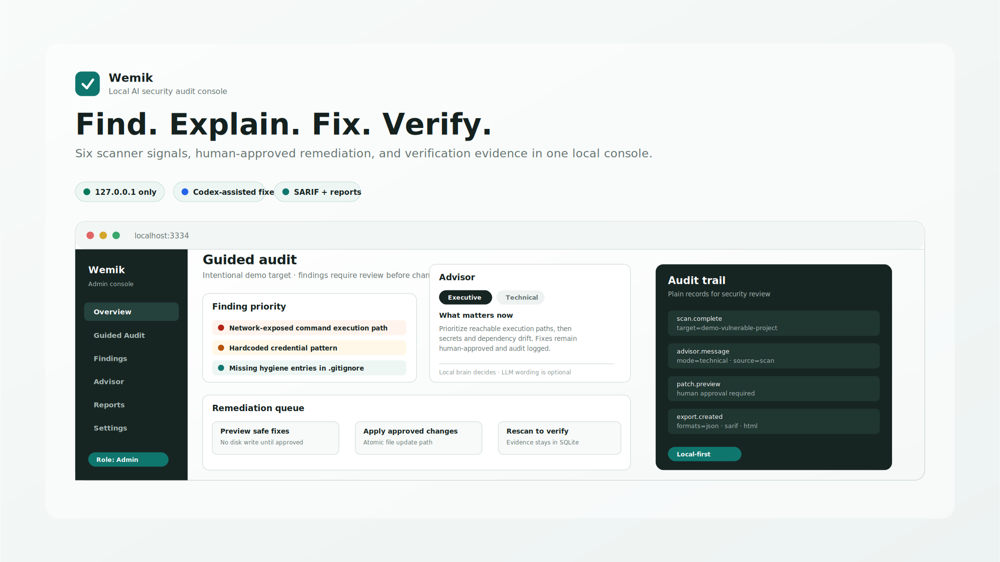

# Wemik



> **The first AI chat that handles sensitive data safely.**
> Your sensitive data is redacted on your machine, kept in a local encrypted vault, and never sent to the model — so regulated teams can finally use AI.

[](#)
[](LICENSE)
[](#)

Wemik is a Claude/ChatGPT-style secure AI chat app. It looks and feels like a
normal chat — a sidebar of conversations, a composer, a thread — but the
differentiator is invisible:

1. You type a prompt that contains sensitive data (a name, email, SSN, account
   number, medical detail).
2. Wemik detects it **locally** and swaps each real value for a placeholder
   (e.g. `john@acme.com` → `[EMAIL_1]`).
3. The real values are stored in a **local, AES-256-GCM encrypted vault** on
   your machine — never in plaintext, never sent anywhere.
4. Only the **redacted** prompt is sent to whatever model your org admin
   configured (offline/sovereign by default, or OpenAI / Anthropic / Ollama).
5. The model replies using the placeholders, and Wemik **restores** the real
   values locally for you to read.

Sensitive data never leaves the machine. That's what lets banks, government,
police, and hospitals use modern AI without leaking regulated information.

Wemik is **not** a standalone model — it wraps the models you already use and
makes them safe to feed.

## Quick Start

```bash
npm install
npm test      # syntax-checks every module
npm start     # opens http://localhost:3334
```

Default model is the **offline "sovereign" provider**, so Wemik works with no
API keys at all. An org admin can switch the provider and add a key from the
in-app ⚙ Model settings (keys are encrypted at rest and masked on read).

On macOS you can also just double-click **`Wemik.command`** — it checks for
Node.js, installs dependencies if needed, and launches the app.

**Local-first by default.** The server binds to `127.0.0.1` only — never a
public interface. Nothing leaves your computer unless an admin explicitly turns
on a remote model provider (bring-your-own-key).

## What's in the box

| Route | What it is |
|-------|------------|
| `/`        | The Wemik secure chat app (the product). |
| `/gateway` | A "how it works" explainer for the sovereign control plane: redact → policy → RBAC → human approval → call model with redacted text only → tamper-evident audit. |

## Architecture

- **`lib/chat/`** — the chat app: `engine.js` (redact against a per-conversation
  vault so the same real value reuses its placeholder across turns; re-identify
  for local display), `store.js` (conversations + messages stored **redacted** +
  encrypted vault), `vaultCrypto.js` (AES-256-GCM), `models.js` (provider router:
  sovereign / OpenAI / Anthropic / Ollama, falling back to an offline echo on any
  failure), `settings.js` (admin model choice + encrypted keys).
- **`lib/gateway/`** — the sovereign control plane behind `/gateway`: PII
  detection/redaction, destination policy, RBAC, and a hash-chained,
  tamper-evident audit log.
- **`lib/`** core — `db.js` (SQLite), `auth.js` (PIN + four-tier RBAC:
  Admin / Operator / Auditor / Viewer with delegated tokens), `audit.js`,
  `env.js`.
- **`dashboard/server.js`** — the Express server tying it together.

## Configuration

Create a local `.env` for any real keys (it's gitignored — never commit keys).
See `.env.example` for the supported variables. Model provider and keys are
normally set from the in-app admin settings rather than env files.

---

Wemik is an ongoing product by Jorge Elizalde.
